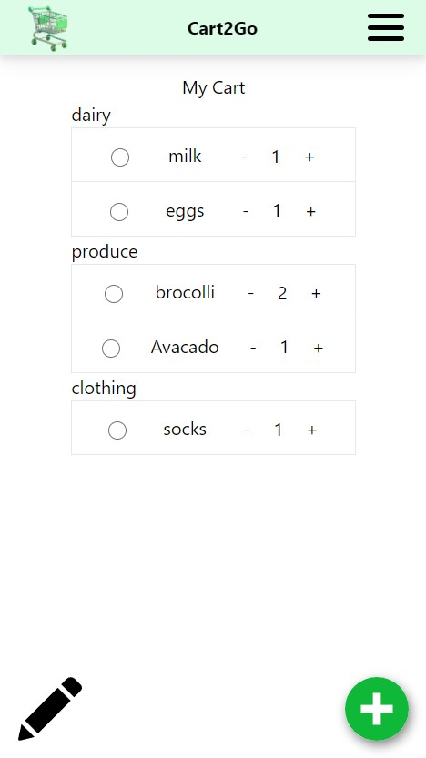

# Cart2Go / shopping_list

<div style="display: flex; justify-content: center;">
    <!-- 
     -->
    
</div>

Cart2Go is a website built to allow users to create shopping list for when needing to go shopping. This list is available to anyone with the account information. Items can be added, editted, removed, and placed into customized categories.
The website includes a login page where you can login and create an account. With recipes and about pages coming soon.

Cart2Go is built using Vue.js on the frontend and ASP.NET Core for the backend.

## Requirements

This project is written using Vue.js and ASP.NET core. Node.js and C# are required to run locally.

## Install and Setup

```
git clone https://github.com/TrevorStreng/shopping_list.git
```

## Frontend

```
cd frontend
npm i
npm run dev
```

## Backend

```
cd backend
dotnet run
```

## Need Help

Connect with me on [LinkedIn](https://www.linkedin.com/in/trevor-streng/)
